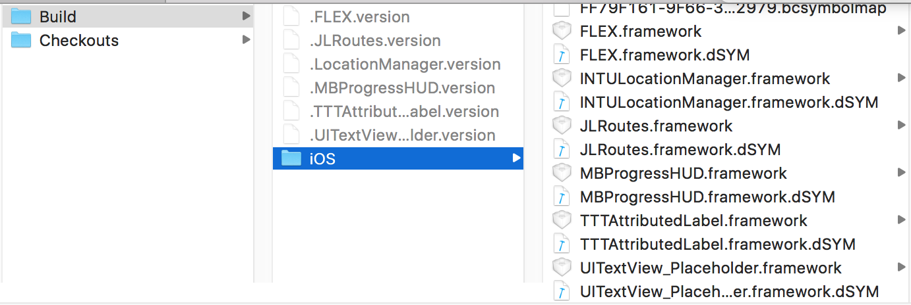
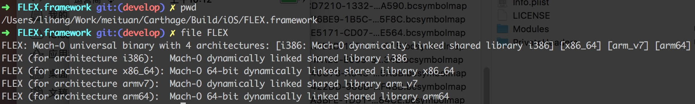
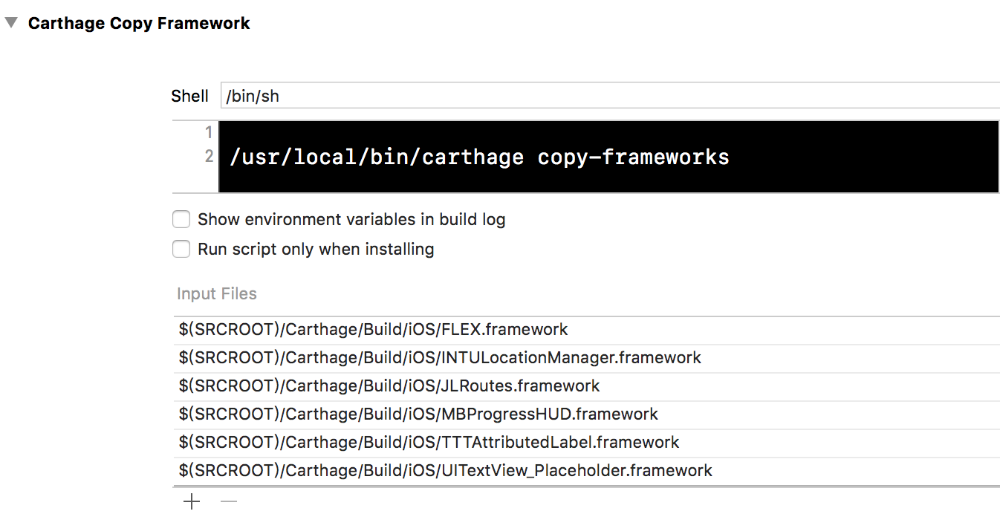
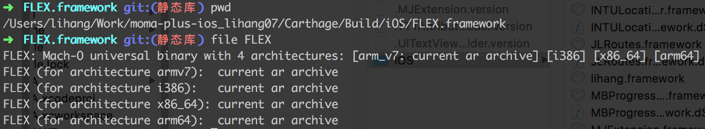
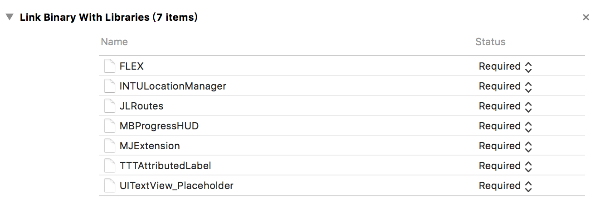
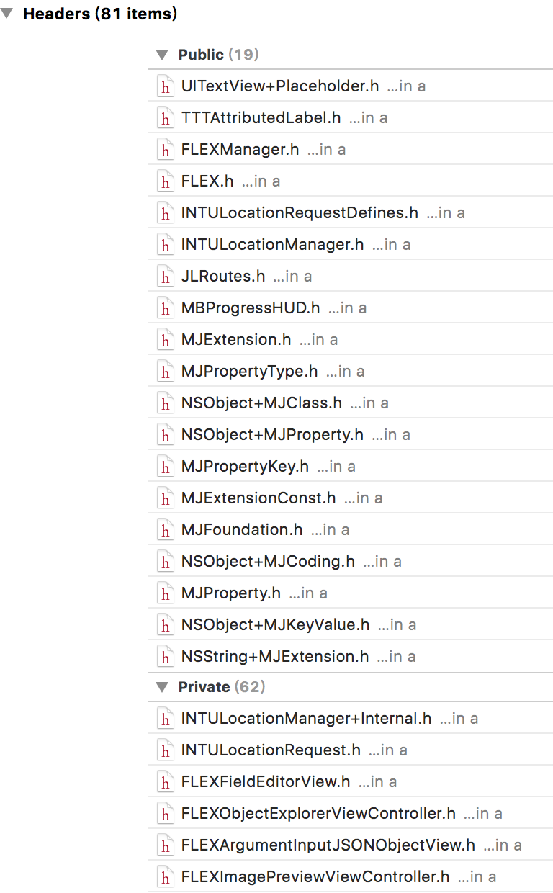
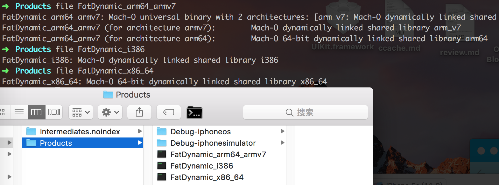
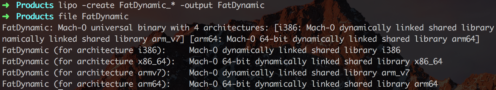
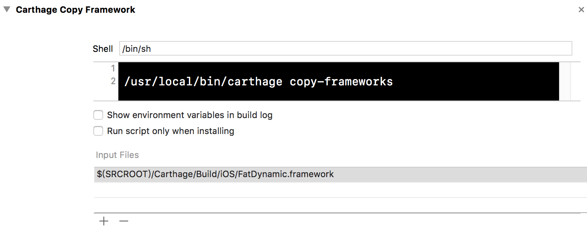
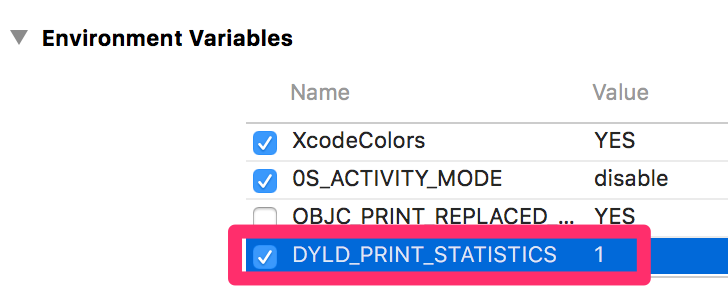

## 合并Carthage dynamic framework
>虽然本文中的dynamic framework是用Carthage集成的，但通样适用于任何static或者dynamic的framework。
>
>本文不会讲dynamic framework对App launchTime造成的影响以及测量方法，这里有几篇文章可以为你提供参考:
>
> * https://useyourloaf.com/blog/slow-app-startup-times/
> * https://blog.automatic.com/how-we-cut-our-ios-apps-launch-time-in-half-with-this-one-cool-trick-7aca2011e2ea
> * http://www.jianshu.com/p/3263009e9228

***

Carthage项目中也有关于如何[合并dynamic framework的文章](https://github.com/Carthage/Carthage/blob/master/Documentation/StaticFrameworks.md),本文按照文章中的描述在自己项目中进行了实践，操作步骤可供大家参考。

*** 

### Carthage目录概览

首先Carthage集成之后的目录大概是这样：

在Build/iOS/目录下存放的是编译好的framework和dSYM文件：

让我们看一看这些framework的架构是什么样的:

可以看到，这些framework都是dynamic类型的。

看到这里不知道你会不会有疑问，这些universal的framework在编译时难道要将不需要的架构也一起link到我们的App中吗？其实不是的，在我们工程的build Phases中会添加一段Script:

这段copy-framework命令其中做的一件事就是在编译后期copy framework到我们的App时会剔除当前不需要的架构，比如当前运行的iPhone 4s模拟器，那么只会保留i386架构，iPhone 4s真机只会保留armv7架构等等。

***
### 准备
下面合并前我们需要一个shell脚本来包装carthage build命令:

`static_framework.sh`

```
#!/bin/sh -e

xcconfig=$(mktemp /tmp/static.xcconfig.XXXXXX)
#trap 'rm -f "$xcconfig"' INT TREM HUP EXIT

echo "LD = $PWD/ld.py" >> $xcconfig
echo "DEBUG_INFORMATION_FORMAT = dwarf" >> $xcconfig

export XCODE_XCCONFIG_FILE="$xcconfig"

cd "$PWD/../"
carthage bootstrap "$@"
```

另外还需要一个[ld.py](https://github.com/keith/swift-staticlibs/blob/master/ld.py)脚本，别忘了用`chmod +x`将ld.py变为可执行文件。最后将这两个脚本文件放到Carthage目录下:


***
### 生成static framework
下面用carthage-build-static.sh将我们在Cartfile中执行的thirdLibrary重新编译成static framework,比如：

```
./carthage-build-static.sh FLEX --platform ios
```
再次查看重新生成的framework:

如果输出中包含`current ar archive`说明已经成功生成了静态framework。

*** 
### 将多个static framework合并成一个dynamic framework
* 新建一个新的空白工程，target选Framework，ProductName比如叫`FatDynamic`：
 
 
* 将刚才生成的那些static framework添加到工程中(切记添加的是framework中的二进制文件，不是framework本身)：
 
* 添加Framework中的Header Files到工程中，记得Private Header别忘了添加：


#### 工程准备就绪，开始编译生成新的framework
我们每次选择不同的模拟器或真机只能编译生成一种架构，比如模拟器4s生成i384，5s生成x84_64,真机4s生成armv7,5s生成arm64。所以我们至少要生成这四种不同架构，然后再把这四种架构再合并起来。


* 合并不同架构

```
lipo -create FatDynamic_* -output FatDynamic
```
合并后再看一下：


至此我们已经将四种不架构合并到一个二进制文件中，最后将FatDynamic再替换到framework中就好了。

### 在工程中使用合并后的framework
* 更改copy-framework脚本

	还记得我们在工程中添加的那个carthage copy-framework的Script吗，合并后的FatDynamic.framework添加到工程中后将copy-framework那里的输入改成FatDynamic.framework就好了。
比如我把FatDynamic.framework放到了Carthage/Build/iOS/目录下，那么copy-framework那里就改成这样：


* 更改工程中framework头文件
  刚才那一步操作后编译工程会出一堆头文件引入错误，原因是原来比如叫<FLEX/FLEX.h>的头文件现在必须全部要改成<FatDynamic/FLEX.h>了。
  
  ****
  ## 测量
至此已经全部将dynamic framework全部合并成一个了，下面是跟合并之前在launchTime，包大小和编译时间方面做一个对比。

### 包大小
* 对不同架构下对合并前后framework体积大小的测量(armv7和arm64一起测量，i386和x86_64一起测量)
  
`Debug`

|架构|合并前|合并后|
|:------|:------|:------|
|i386和x86_64 |3.3M|2.9M|
|armv7和arm64|10M|2.8M|

`Release`

|架构|合并前|合并后|
|:------|:------|:------|
|i386和x86_64|3.3M|2.9M|
|armv7和arm64|10M|2.8M|

* 对Archive出的ipa大小进行测量

||ipa大小|
|:------|:------|
|未集成carthage|11.5M|
|集成Carthage|12M|
|合并framework后|11.8M|

### LaunchTime
 * 先配置环境变量
 

 * 记录log时间输出并统计（用iPhone 6Plus真机热启动测量）
 
 ```
 Total pre-main time: 304.60 milliseconds (100.0%)
         dylib loading time:  51.27 milliseconds (16.8%)
        rebase/binding time:  62.26 milliseconds (20.4%)
            ObjC setup time:  82.10 milliseconds (26.9%)
           initializer time: 108.87 milliseconds (35.7%)
           slowest intializers :
               libSystem.dylib :   2.74 milliseconds (0.9%)
                       Intents :  12.06 milliseconds (3.9%)
                          moma : 169.28 milliseconds (55.5%)
 ```
 
 我们这里着重关注的是`dylib loading time`,分
 
 `A`:只用pod集成，
 
 `B`:用carthage集成，
 
 `C`:合并carthage中的framework
 
 这三种情况来测量，每次测量取10次样本。
 
 * A
 
 ```
         dylib loading time:  75.44 milliseconds (7.8%)
         dylib loading time:  26.67 milliseconds (8.1%)
         dylib loading time:  75.63 milliseconds (34.2%)
         dylib loading time:  75.24 milliseconds (33.6%)
         dylib loading time:  73.29 milliseconds (32.8%)
         dylib loading time:  25.10 milliseconds (15.3%)
         dylib loading time:  72.00 milliseconds (34.8%)
         dylib loading time:  72.42 milliseconds (26.3%)
         dylib loading time:  41.42 milliseconds (22.4%)
         dylib loading time:  74.18 milliseconds (35.4%)
 ```
 
 * B

 ```
         dylib loading time: 957.53 milliseconds (84.0%)
         dylib loading time: 934.26 milliseconds (84.8%)
         dylib loading time: 895.84 milliseconds (84.2%)
         dylib loading time: 891.37 milliseconds (85.0%)
         dylib loading time: 885.75 milliseconds (84.6%)
         dylib loading time: 959.70 milliseconds (86.0%)
         dylib loading time: 848.98 milliseconds (85.9%)
         dylib loading time: 891.43 milliseconds (85.3%)
         dylib loading time: 841.54 milliseconds (84.4%)
         dylib loading time: 887.29 milliseconds (84.6%)
 ```
 
 * C

 ```
         dylib loading time: 263.26 milliseconds (32.5%)
         dylib loading time: 210.42 milliseconds (29.4%)
         dylib loading time: 284.74 milliseconds (41.3%)
         dylib loading time: 320.13 milliseconds (66.2%)
         dylib loading time: 253.91 milliseconds (61.3%)
         dylib loading time: 267.09 milliseconds (65.5%)
         dylib loading time: 301.85 milliseconds (68.9%)
         dylib loading time: 195.40 milliseconds (58.3%)
         dylib loading time: 276.08 milliseconds (62.4%)
         dylib loading time: 194.99 milliseconds (57.0%)
 ```
 
 统计结果
 
 ||dylib loading time|
|:------|:------|
|A|61.139ms|
|B|899.369ms|
|C|256.787|

## 编译时间测量
按上面A B C三种情况分类（单位：秒）

||A|B|C|
|:------|:------|:------|:------|
|1|268.849|287.625|259.176|
|2|281.005|298.295|277.035|
|3|318.630|268.916|275.197|
|4|297.886|266.290|280.478|
|5|311.531|297.556|276.178|
|6|262.457|256.155|282.912|
|7|263.327|248.027|250.735|
|8|268.094|241.416|253.723|
|9|267.711|243.059|282.751|
|10|267.252|238.338|267.464|
|平均值|280.674|264.568|270.565|
